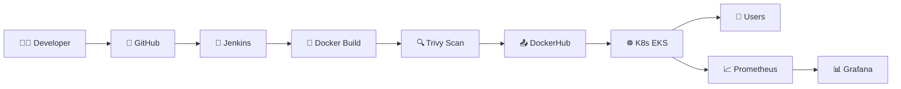
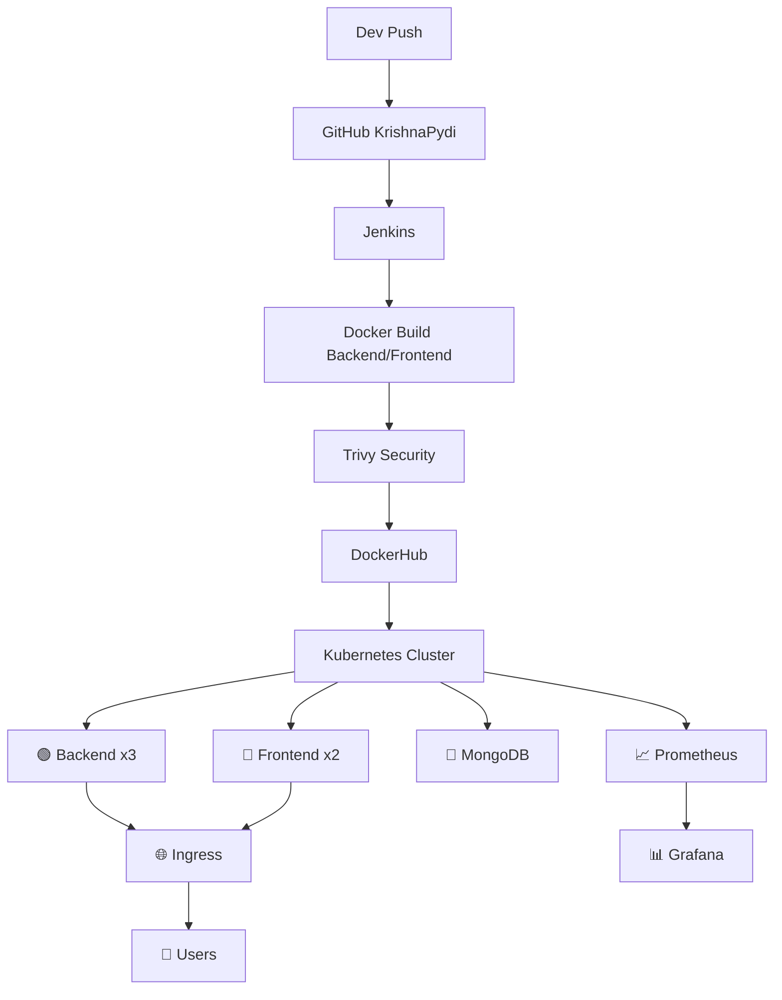

# 🛒 FreshMart - Full DevOps Production Platform
### 👨‍💻 By KrishnaPydi - https://github.com/KrishnaPydi

[DevOps](https://img.shields.io/badge/DevOps-Production-red?style=for-the-badge)
[Docker](https://img.shields.io/badge/Docker-Ready-2496ED?style=for-the-badge&logo=docker)
[K8s](https://img.shields.io/badge/Kubernetes-EKS-326CE5?style=for-the-badge&logo=kubernetes)
[Jenkins](https://img.shields.io/badge/Jenkins-CI/CD-D24939?style=for-the-badge&logo=jenkins)

---

## 🏗️ DevOps Pipeline Flow Chart





---

## 🛠️ Tech Stack

| Layer | Tool |
| :--- | :--- |
| 🌿 Source | GitHub |
| 🐳 Container | Docker |
| ☸️ Orchestration | Kubernetes EKS |
| 🤖 CI | Jenkins |
| 🚀 CD | ArgoCD |
| 🌍 IaC | Terraform |
| 📈 Monitoring | Prometheus |
| 📊 Dashboard | Grafana |
| 🔍 Security | Trivy |

---

## 📁 Project Structure

```
FreshMart_App/
├── backend/
├── frontend/
├── k8s/
├── monitoring/
├── terraform/
├── docker-compose.yml
├── Jenkinsfile
└── README.md
```

---

## 💻 FULL SOURCE CODE

### 1️⃣ backend/server.js

```javascript
const express = require('express');
const mongoose = require('mongoose');
const cors = require('cors');
const app = express();

app.use(cors());
app.use(express.json());

mongoose.connect(process.env.MONGO_URI || 'mongodb://mongodb:27017/freshmart')
.then(()=> console.log('🍃 MongoDB Connected'));

app.get('/api/health', (req,res) => res.json({status:'OK', service:'FreshMart Backend'}));

app.get('/api/products', (req,res) => {
  res.json([
    {id:1, name:'Tomato', price:30, image:'🍅'},
    {id:2, name:'Milk', price:50, image:'🥛'},
    {id:3, name:'Bread', price:40, image:'🍞'}
  ]);
});

const PORT = 5000;
app.listen(PORT, ()=> console.log(`🟢 Backend running on ${PORT}`));
```

### 2️⃣ backend/package.json

```json
{
  "name": "freshmart-backend",
  "scripts": { "start": "node server.js" },
  "dependencies": {
    "express": "^4.18.0",
    "mongoose": "^7.0.0",
    "cors": "^2.8.5"
  }
}
```

### 3️⃣ backend/Dockerfile

```dockerfile
FROM node:18-alpine
WORKDIR /app
COPY package*.json./
RUN npm install
COPY..
EXPOSE 5000
CMD ["npm","start"]
```

### 4️⃣ frontend/src/App.js

```javascript
import React, {useEffect, useState} from 'react';
function App(){
  const [products, setProducts] = useState([]);
  useEffect(()=>{
    fetch('http://localhost:5000/api/products')
   .then(r=>r.json()).then(setProducts);
  },[]);
  return (
    <div>
      <h1>🛒 FreshMart - KrishnaPydi</h1>
      {products.map(p=> <div key={p.id}>{p.image} {p.name} - Rs.{p.price}</div>)}
    </div>
  )
}
export default App;
```

### 5️⃣ frontend/Dockerfile

```dockerfile
FROM node:18-alpine as build
WORKDIR /app
COPY package*.json./
RUN npm install
COPY..
RUN npm run build
FROM nginx:alpine
COPY --from=build /app/build /usr/share/nginx/html
EXPOSE 80
CMD ["nginx","-g","daemon off;"]
```

### 6️⃣ docker-compose.yml - Full Stack

```yaml
version: '3.8'
services:
  mongodb:
    image: mongo:6
    ports: ["27017:27017"]
    volumes: ["mongo-data:/data/db"]
  backend:
    build:./backend
    ports: ["5000:5000"]
    environment:
            - MONGO_URI=mongodb://mongodb:27017/freshmart
    depends_on: ["mongodb"]
  frontend:
    build:./frontend
    ports: ["3000:80"]
    depends_on: ["backend"]
volumes:
  mongo-data:
```

### 7️⃣ k8s/01-namespace.yaml

```yaml
apiVersion: v1
kind: Namespace
metadata:
  name: freshmart
```

### 8️⃣ k8s/02-mongodb.yaml

```yaml
apiVersion: apps/v1
kind: Deployment
metadata:
  name: mongodb
  namespace: freshmart
spec:
  replicas: 1
  selector:
    matchLabels: {app: mongodb}
  template:
    metadata:
      labels: {app: mongodb}
    spec:
      containers:
            - name: mongodb
        image: mongo:6
        ports: [{containerPort: 27017}]
---
apiVersion: v1
kind: Service
metadata:
  name: mongodb
  namespace: freshmart
spec:
  selector: {app: mongodb}
  ports: [{port: 27017}]
```

### 9️⃣ k8s/03-backend.yaml

```yaml
apiVersion: apps/v1
kind: Deployment
metadata:
  name: backend
  namespace: freshmart
spec:
  replicas: 3
  selector:
    matchLabels: {app: backend}
  template:
    metadata:
      labels: {app: backend}
    spec:
      containers:
            - name: backend
        image: hexagon/freshmart-backend:latest
        ports: [{containerPort: 5000}]
        env:
                - name: MONGO_URI
          value: mongodb://mongodb:27017/freshmart
---
apiVersion: v1
kind: Service
metadata:
  name: backend
  namespace: freshmart
spec:
  selector: {app: backend}
  ports: [{port: 5000}]
```

### 🔟 k8s/04-frontend.yaml

```yaml
apiVersion: apps/v1
kind: Deployment
metadata:
  name: frontend
  namespace: freshmart
spec:
  replicas: 2
  selector:
    matchLabels: {app: frontend}
  template:
    metadata:
      labels: {app: frontend}
    spec:
      containers:
            - name: frontend
        image: hexagon/freshmart-frontend:latest
        ports: [{containerPort: 80}]
---
apiVersion: v1
kind: Service
metadata:
  name: frontend
  namespace: freshmart
spec:
  selector: {app: frontend}
  ports: [{port: 80}]
```

### 1️⃣1️⃣ k8s/05-hpa.yaml - Auto Scaling

```yaml
apiVersion: autoscaling/v2
kind: HorizontalPodAutoscaler
metadata:
  name: backend-hpa
  namespace: freshmart
spec:
  scaleTargetRef:
    apiVersion: apps/v1
    kind: Deployment
    name: backend
  minReplicas: 2
  maxReplicas: 10
  metrics:
    - type: Resource
    resource:
      name: cpu
      target:
        type: Utilization
        averageUtilization: 70
```

### 1️⃣2️⃣ Jenkinsfile - CI/CD Pipeline

```groovy
pipeline {
  agent any
  stages {
    stage('🌿 Clone') {
      steps { git 'https://github.com/KrishnaPydi/FreshMart_App.git' }
    }
    stage('🐳 Docker Build') {
      steps {
        sh 'docker build -t hexagon/freshmart-backend:latest./backend'
        sh 'docker build -t hexagon/freshmart-frontend:latest./frontend'
      }
    }
    stage('🔍 Trivy Scan') {
      steps { sh 'trivy image hexagon/freshmart-backend:latest' }
    }
    stage('📤 Push to DockerHub') {
      steps {
        withDockerRegistry([credentialsId: 'dockerhub']){
          sh 'docker push hexagon/freshmart-backend:latest'
          sh 'docker push hexagon/freshmart-frontend:latest'
        }
      }
    }
    stage('☸️ Deploy to K8s') {
      steps { sh 'kubectl apply -f k8s/' }
    }
  }
}
```

### 1️⃣3️⃣ monitoring/prometheus.yml

```yaml
global:
  scrape_interval: 15s
scrape_configs:
    - job_name: 'freshmart-backend'
    static_configs:
            - targets: ['backend:5000']
    - job_name: 'kubernetes'
    kubernetes_sd_configs:
            - role: pod
```

### 1️⃣4️⃣ terraform/main.tf - EKS Cluster

```hcl
provider "aws" { region = "ap-south-1" }

module "eks" {
  source = "terraform-aws-modules/eks/aws"
  cluster_name = "freshmart-eks"
  cluster_version = "1.28"
  vpc_id = "vpc-xxxx"
  subnet_ids = ["subnet-xxxx","subnet-yyyy"]
  eks_managed_node_groups = {
    main = { instance_types = ["t3.medium"] min_size=2 max_size=4 desired_size=2 }
  }
}
```

---

## 🚀 How to Run

```bash
git clone https://github.com/KrishnaPydi/FreshMart_App.git
cd FreshMart_App
docker-compose up --build
```

**Access:**
- Frontend: http://localhost:3000
- Backend: http://localhost:5000/api/products
- Prometheus: http://localhost:9090
- Grafana: http://localhost:3002

---

## 👨‍💻 Author

**KrishnaPydi**
GitHub: https://github.com/KrishnaPydi
Project: FreshMart DevOps Production Platform
