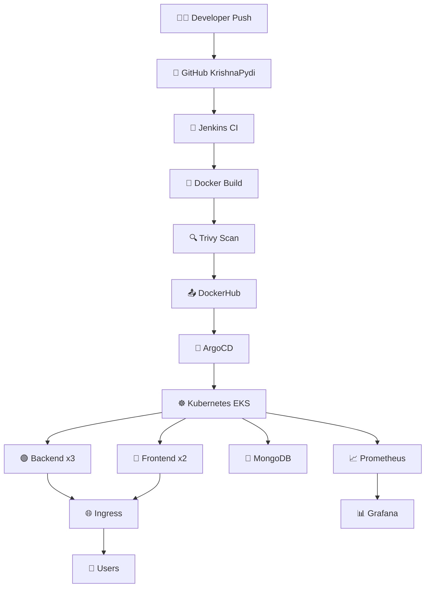

# 🛒 FreshMart - Full DevOps Production Platform
### 👨‍💻 By KrishnaPydi | Hexagon Digital Services


---

## 📖 Overview
FreshMart is a scalable MERN Stack grocery app with full DevOps automation from Local to Production with Monitoring.

**Features:**
- 🛍️ Product, Cart, Order Management
- 🔐 JWT Auth + Admin Panel
- 📦 Auto Scaling with K8s HPA
- 📊 Prometheus + Grafana Monitoring

---

## 🏗️ Architecture Flow Chart with Icons



---

## 🛠️ Tech Stack - 2026 Market Standard

| Layer | Icon | Tool | Use |
| :--- | :--- | :--- | :--- |
| Source | 🌿 | GitHub | Code Repo |
| Container | 🐳 | Docker | Container |
| Orchestration | ☸️ | Kubernetes EKS | Deploy |
| IaC | 🌍 | Terraform | Infra |
| CI | 🤖 | Jenkins | Build |
| CD | 🚀 | ArgoCD | GitOps |
| Monitoring | 📈 | Prometheus | Metrics |
| Dashboard | 📊 | Grafana | UI |
| Security | 🔍 | Trivy | Scan |
| Scaling | 📏 | HPA | Auto Scale |

---

## 📁 Project Structure - Full Code

```
FreshMart_App/
├── backend/               # 🟢 Node.js API
│   ├── server.js
│   ├── models/
│   └── Dockerfile
├── frontend/              # 🔵 React App
│   ├── src/
│   └── Dockerfile
├── admin/                 # 🟣 Admin Panel
│   └── Dockerfile
├── k8s/                   # ☸️ K8s Manifests
│   ├── 01-namespace.yaml
│   ├── 02-mongodb.yaml
│   ├── 03-backend.yaml
│   ├── 04-frontend.yaml
│   ├── 05-ingress.yaml
│   └── 06-hpa.yaml
├── monitoring/            # 📈 Monitoring
│   ├── prometheus.yml
│   └── grafana-dashboard.json
├── terraform/             # 🌍 IaC
│   └── main.tf
├── .github/workflows/     # 🔄 GitHub Actions
│   └── ci-cd.yml
├── docker-compose.yml     # 🐳 Local Dev
├── Jenkinsfile            # 🤖 Jenkins Pipeline
└── README.md              # 📖 This File
```

---

## ⚡ Quick Start - 2 Min

```bash
# Clone
git clone https://github.com/KrishnaPydi/FreshMart_App.git
cd FreshMart_App

# Run Locally
docker-compose up --build

# Access
Frontend -> http://localhost:3000
Admin -> http://localhost:3001
Backend -> http://localhost:5000
Prometheus -> http://localhost:9090
Grafana -> http://localhost:3002 (admin/admin)
```

---

## 🔄 CI/CD Pipeline Flow

```
👨‍💻 Git Push (KrishnaPydi)
  ↓
🤖 Jenkins Trigger
  ↓
🐳 Docker Build Backend, Frontend, Admin
  ↓
🔍 Trivy Vulnerability Scan
  ↓
📤 Push to DockerHub - hexagon/freshmart
  ↓
🚀 Deploy to EKS via kubectl
  ↓
✅ Health Check
  ↓
📊 Monitor in Grafana
```

---

## ☸️ Production Deploy - EKS

```bash
cd terraform
terraform init
terraform apply

kubectl apply -f k8s/
kubectl get pods -n freshmart -w
```

---

## 📊 Monitoring

Import Dashboard: `monitoring/grafana-dashboard.json` -> Grafana ID 1860

---

## 👨‍💻 Author: KrishnaPydi
GitHub: https://github.com/KrishnaPydi

⭐ Star this repo if you like!
```

---
